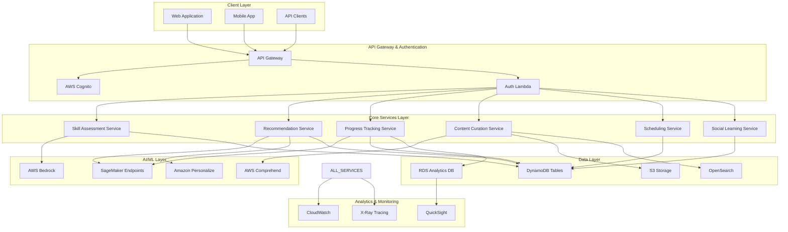

# Design Document: SkillPathAI

## Overview

SkillPathAI is a cloud-native, AI-driven learning and productivity advisory system built on AWS infrastructure. The system leverages advanced AI/ML services to provide personalized learning experiences through intelligent skill assessment, adaptive content curation, and dynamic progress tracking. The architecture follows serverless-first principles with microservices design patterns to ensure scalability, cost-effectiveness, and maintainability.

The system serves as a comprehensive learning platform that transforms traditional one-size-fits-all education into personalized, adaptive learning journeys. By combining AWS Bedrock's foundation models with SageMaker's machine learning capabilities, SkillPathAI creates intelligent learning paths that evolve with user progress and preferences.

## Architecture

### High-Level Architecture



### Microservices Architecture

The system is decomposed into six core microservices, each responsible for specific business capabilities:

1. **Skill Assessment Service**: Handles adaptive skill evaluation using AWS Bedrock
2. **Recommendation Service**: Generates personalized learning paths using SageMaker and Personalize
3. **Progress Tracking Service**: Monitors learning analytics and adaptation triggers
4. **Content Curation Service**: Discovers, evaluates, and organizes learning resources
5. **Scheduling Service**: Manages time optimization and calendar integration
6. **Social Learning Service**: Facilitates peer connections and collaborative learning

Each service is implemented as AWS Lambda functions with dedicated DynamoDB tables for data persistence, ensuring loose coupling and independent scalability.

## Components and Interfaces

### Skill Assessment Service

**Purpose**: Conducts intelligent, adaptive skill assessments using conversational AI and domain-specific evaluation frameworks.

**Key Components**:
- **Assessment Engine**: Orchestrates multi-domain skill evaluation workflows
- **Question Generator**: Uses AWS Bedrock to create contextual, adaptive questions
- **Response Analyzer**: Leverages Claude/GPT models to evaluate answer quality and depth
- **Skill Profiler**: Generates comprehensive competency maps with confidence scores

**Interfaces**:
```typescript
interface SkillAssessmentService {
  startAssessment(userId: string, domains: string[]): AssessmentSession
  submitResponse(sessionId: string, questionId: string, response: string): NextQuestion
  completeAssessment(sessionId: string): SkillProfile
  getSkillProfile(userId: string): SkillProfile
}

interface SkillProfile {
  userId: string
  domains: SkillDomain[]
  overallScore: number
  assessmentDate: Date
  confidenceLevel: number
}
```

### Recommendation Service

**Purpose**: Generates personalized learning paths using collaborative filtering, content-based filtering, and deep learning models.

**Key Components**:
- **Path Generator**: Creates structured learning sequences using SageMaker models
- **Content Matcher**: Aligns learning resources with user preferences and skill gaps
- **Difficulty Calibrator**: Adjusts content complexity based on user progress patterns
- **Multi-Modal Optimizer**: Balances different learning modalities (video, text, interactive)

**Interfaces**:
```typescript
interface RecommendationService {
  generateLearningPath(userId: string, goals: LearningGoal[]): LearningPath
  updateRecommendations(userId: string, feedback: UserFeedback): void
  getNextActivity(userId: string, pathId: string): LearningActivity
  adaptPath(userId: string, pathId: string, progressData: ProgressData): LearningPath
}

interface LearningPath {
  pathId: string
  userId: string
  goals: LearningGoal[]
  activities: LearningActivity[]
  estimatedDuration: number
  difficultyLevel: DifficultyLevel
}
```

### Progress Tracking Service

**Purpose**: Monitors learning analytics, detects patterns, and triggers adaptive responses using machine learning models.

**Key Components**:
- **Activity Monitor**: Tracks completion rates, time spent, and engagement metrics
- **Pattern Detector**: Uses SageMaker to identify learning velocity and preference patterns
- **Adaptation Trigger**: Initiates path modifications based on performance thresholds
- **Analytics Aggregator**: Compiles comprehensive learning dashboards

**Interfaces**:
```typescript
interface ProgressTrackingService {
  recordActivity(userId: string, activityId: string, completion: CompletionData): void
  getProgressSummary(userId: string, timeframe: TimeFrame): ProgressSummary
  detectLearningPatterns(userId: string): LearningPatterns
  triggerAdaptation(userId: string, trigger: AdaptationTrigger): void
}

interface ProgressSummary {
  userId: string
  completedActivities: number
  totalTimeSpent: number
  averageScore: number
  learningVelocity: number
  engagementLevel: EngagementLevel
}
```

### Content Curation Service

**Purpose**: Discovers, evaluates, and organizes learning resources using AI-powered content analysis and quality assessment.

**Key Components**:
- **Content Crawler**: Automated discovery of learning resources from multiple sources
- **Quality Evaluator**: Uses AWS Comprehend and custom models to assess content quality
- **Metadata Extractor**: Generates rich metadata including topics, difficulty, and learning objectives
- **Search Engine**: Provides semantic search capabilities using OpenSearch

**Interfaces**:
```typescript
interface ContentCurationService {
  discoverContent(topics: string[], sources: ContentSource[]): ContentItem[]
  evaluateQuality(contentId: string): QualityScore
  searchContent(query: SearchQuery): SearchResults
  updateContentMetadata(contentId: string, metadata: ContentMetadata): void
}

interface ContentItem {
  contentId: string
  title: string
  description: string
  contentType: ContentType
  difficulty: DifficultyLevel
  topics: string[]
  qualityScore: number
  estimatedDuration: number
}
```

### Scheduling Service

**Purpose**: Optimizes learning schedules based on user availability, learning patterns, and goal deadlines.

**Key Components**:
- **Calendar Integrator**: Syncs with external calendar systems (Google, Outlook)
- **Time Optimizer**: Uses optimization algorithms to find optimal learning slots
- **Reminder System**: Sends intelligent notifications via SNS
- **Conflict Resolver**: Handles scheduling conflicts and suggests alternatives

**Interfaces**:
```typescript
interface SchedulingService {
  createSchedule(userId: string, learningPath: LearningPath, constraints: TimeConstraints): Schedule
  updateAvailability(userId: string, availability: AvailabilityWindow[]): void
  handleConflict(userId: string, conflictId: string, resolution: ConflictResolution): void
  sendReminder(userId: string, activityId: string, reminderType: ReminderType): void
}

interface Schedule {
  userId: string
  scheduledActivities: ScheduledActivity[]
  totalWeeklyHours: number
  nextActivity: ScheduledActivity
  upcomingDeadlines: Deadline[]
}
```

### Social Learning Service

**Purpose**: Facilitates peer connections, study groups, and collaborative learning experiences.

**Key Components**:
- **Peer Matcher**: Connects users with similar goals and complementary skills
- **Group Manager**: Creates and manages study groups and learning communities
- **Collaboration Tools**: Provides shared workspaces and discussion forums
- **Mentorship System**: Matches learners with experienced mentors

**Interfaces**:
```typescript
interface SocialLearningService {
  findPeers(userId: string, criteria: PeerCriteria): User[]
  createStudyGroup(creatorId: string, groupConfig: GroupConfiguration): StudyGroup
  joinGroup(userId: string, groupId: string): void
  requestMentorship(userId: string, domain: string): MentorshipRequest
}

interface StudyGroup {
  groupId: string
  name: string
  description: string
  members: User[]
  sharedGoals: LearningGoal[]
  meetingSchedule: MeetingSchedule
  collaborationSpace: CollaborationSpace
}
```

## Data Models

### User Profile Data Model

```typescript
interface UserProfile {
  userId: string                    // Partition Key
  email: string
  name: string
  createdAt: Date
  lastLoginAt: Date
  preferences: UserPreferences
  skillProfile: SkillProfile
  learningGoals: LearningGoal[]
  subscriptionTier: SubscriptionTier
}

interface UserPreferences {
  learningStyle: LearningStyle[]    // Visual, Auditory, Kinesthetic, Reading
  contentTypes: ContentType[]       // Video, Article, Interactive, Podcast
  difficultyPreference: DifficultyPreference
  timeZone: string
  language: string
  notificationSettings: NotificationSettings
}
```

### Learning Path Data Model

```typescript
interface LearningPath {
  pathId: string                    // Partition Key
  userId: string                    // GSI Partition Key
  title: string
  description: string
  createdAt: Date
  updatedAt: Date
  status: PathStatus               // Active, Completed, Paused, Archived
  goals: LearningGoal[]
  activities: LearningActivity[]
  metadata: PathMetadata
  analytics: PathAnalytics
}

interface LearningActivity {
  activityId: string
  contentId: string
  title: string
  description: string
  contentType: ContentType
  estimatedDuration: number
  difficulty: DifficultyLevel
  prerequisites: string[]
  learningObjectives: string[]
  completionCriteria: CompletionCriteria
}
```

### Progress Tracking Data Model

```typescript
interface ProgressRecord {
  recordId: string                  // Partition Key: userId#activityId
  userId: string                    // GSI Partition Key
  activityId: string
  pathId: string
  startedAt: Date
  completedAt?: Date
  timeSpent: number
  score?: number
  completionStatus: CompletionStatus
  feedback: UserFeedback
  adaptationTriggers: AdaptationTrigger[]
}

interface LearningAnalytics {
  userId: string                    // Partition Key
  date: string                      // Sort Key (YYYY-MM-DD)
  dailyMetrics: DailyMetrics
  weeklyTrends: WeeklyTrends
  monthlyProgress: MonthlyProgress
  learningPatterns: LearningPatterns
}
```

### Content Repository Data Model

```typescript
interface ContentItem {
  contentId: string                 // Partition Key
  title: string
  description: string
  contentType: ContentType
  sourceUrl: string
  createdAt: Date
  lastUpdatedAt: Date
  qualityScore: number
  metadata: ContentMetadata
  topics: string[]
  difficulty: DifficultyLevel
  estimatedDuration: number
  prerequisites: string[]
  learningObjectives: string[]
}

interface ContentMetadata {
  author: string
  publisher: string
  publicationDate: Date
  language: string
  format: string
  fileSize?: number
  thumbnailUrl?: string
  tags: string[]
  reviews: ContentReview[]
}
```

### DynamoDB Table Design

**Primary Tables**:
1. **Users**: Partition Key: userId
2. **LearningPaths**: Partition Key: pathId, GSI: userId
3. **ProgressRecords**: Partition Key: userId#activityId, GSI: userId
4. **ContentItems**: Partition Key: contentId, GSI: contentType
5. **StudyGroups**: Partition Key: groupId, GSI: userId (for member lookups)

**Access Patterns**:
- Get user profile: Query Users by userId
- Get user's learning paths: Query LearningPaths GSI by userId
- Get user's progress: Query ProgressRecords GSI by userId
- Search content by type: Query ContentItems GSI by contentType
- Find user's groups: Query StudyGroups GSI by userId

## Correctness Properties

*A property is a characteristic or behavior that should hold true across all valid executions of a system—essentially, a formal statement about what the system should do. Properties serve as the bridge between human-readable specifications and machine-verifiable correctness guarantees.*

### Property 1: Complete User Profile Management
*For any* user registration or profile update, the system should capture and persist all required profile components (basic info, skills, goals, preferences) and make them retrievable with data integrity preserved.
**Validates: Requirements 1.1, 1.2, 1.3, 1.4**

### Property 2: Adaptive Skill Assessment Behavior  
*For any* skill assessment session, the system should generate adaptive questions based on previous responses, analyze response quality using AI services, and produce comprehensive skill profiles with identified gaps and strengths.
**Validates: Requirements 2.1, 2.2, 2.3, 2.4**

### Property 3: Personalized Learning Path Generation
*For any* learning path request, the system should analyze user data (profile, skills, goals), generate personalized sequences using AI services, ensure time constraint alignment, and provide multiple pathway options with appropriate metadata.
**Validates: Requirements 3.1, 3.2, 3.3, 3.5**

### Property 4: Intelligent Content Curation and Quality Management
*For any* content discovery and curation process, the system should search multiple source types, evaluate quality using AI analysis, automatically categorize resources, manage content freshness, and maintain diversity across content types and modalities.
**Validates: Requirements 4.1, 4.2, 4.3, 4.4, 4.5, 3.4**

### Property 5: Adaptive Progress Tracking and Response
*For any* learning activity completion or progress analysis, the system should record comprehensive tracking data, identify patterns using ML services, adapt recommendations based on velocity changes, detect difficulties and provide support, and recognize milestone achievements.
**Validates: Requirements 5.1, 5.2, 5.3, 5.4, 5.5**

### Property 6: Intelligent Scheduling and Conflict Management
*For any* scheduling request or conflict scenario, the system should generate realistic schedules within availability constraints, integrate with external calendars, resolve conflicts with alternative suggestions, handle missed sessions with rescheduling, and prioritize optimal learning times.
**Validates: Requirements 6.1, 6.2, 6.3, 6.4, 6.5**

### Property 7: Social Learning and Peer Matching
*For any* social learning feature usage, the system should match users with similar goals for partnerships, connect learners with appropriate mentors based on expertise, facilitate collaborative activities, and incorporate peer feedback into progress tracking.
**Validates: Requirements 7.1, 7.2, 7.3, 7.4**

### Property 8: Comprehensive Analytics and Insights Generation
*For any* analytics request or performance analysis, the system should generate comprehensive dashboards, create interactive visualizations using AWS services, provide actionable improvement recommendations, perform benchmarking against similar learners, and export data in multiple formats.
**Validates: Requirements 8.1, 8.2, 8.3, 8.4, 8.5**

### Property 9: Multi-Modal Learning Support and Accessibility
*For any* content presentation or learning preference, the system should offer multiple content formats (text, video, audio, interactive), provide accessibility features for users with disabilities, optimize mobile experiences, enable offline learning capabilities, and prioritize preferred content formats in recommendations.
**Validates: Requirements 9.1, 9.2, 9.3, 9.4, 9.5**

### Property 10: Comprehensive API Integration and External System Support
*For any* external integration requirement, the system should provide complete REST APIs, implement secure authentication using AWS Cognito, support real-time data synchronization, enable webhook notifications for important events, and provide usage analytics with rate limiting.
**Validates: Requirements 10.1, 10.2, 10.3, 10.4, 10.5**

### Property 11: Serverless Architecture and Content Delivery
*For any* AI processing or content delivery request, the system should utilize AWS Lambda for serverless compute scaling and AWS CloudFront for global content distribution, ensuring proper architecture patterns are followed.
**Validates: Requirements 11.3, 11.4**

### Property 12: Comprehensive Security and Compliance
*For any* data storage, transmission, or user interaction, the system should encrypt sensitive data using AWS KMS, provide multi-factor authentication options, use HTTPS for all communications, offer data export and deletion capabilities for privacy compliance, and implement threat detection using AWS GuardDuty.
**Validates: Requirements 12.1, 12.2, 12.3, 12.4, 12.5**

### Property 13: Real-Time System Monitoring and Performance Metrics
*For any* system operation or monitoring request, the system should provide real-time performance metrics, alerting capabilities, and comprehensive system health monitoring to ensure operational excellence.
**Validates: Requirements 11.5**

## Error Handling

### Error Classification and Response Strategy

**User Input Errors**:
- Invalid skill assessment responses → Provide clarification prompts and alternative question formats
- Malformed learning goals → Guide users through structured goal definition process
- Scheduling conflicts → Offer alternative time slots and priority-based resolution

**System Integration Errors**:
- AWS service failures → Implement circuit breaker patterns with graceful degradation
- External content source unavailability → Fall back to cached content and alternative sources
- Calendar integration failures → Provide manual scheduling options and retry mechanisms

**Data Consistency Errors**:
- Profile synchronization issues → Implement eventual consistency with conflict resolution
- Progress tracking discrepancies → Use timestamp-based reconciliation and user confirmation
- Content metadata inconsistencies → Automated validation with manual review queues

**Performance and Scalability Errors**:
- High latency responses → Implement caching layers and request prioritization
- Resource exhaustion → Auto-scaling with load shedding for non-critical features
- Rate limiting violations → Implement exponential backoff and user notification

### Error Recovery Mechanisms

**Automatic Recovery**:
- Retry logic with exponential backoff for transient failures
- Circuit breaker patterns for external service dependencies
- Automatic failover to backup systems and cached data

**User-Assisted Recovery**:
- Clear error messages with suggested actions
- Alternative workflow paths when primary features are unavailable
- Manual override options for automated decisions

**Administrative Recovery**:
- Comprehensive logging and monitoring for issue diagnosis
- Administrative tools for data correction and system state management
- Rollback capabilities for problematic deployments

## Testing Strategy

### Dual Testing Approach

The testing strategy employs both unit testing and property-based testing to ensure comprehensive coverage and correctness validation.

**Unit Testing Focus**:
- Specific examples demonstrating correct behavior for each service
- Integration points between microservices and AWS services
- Edge cases and error conditions for each component
- Authentication and authorization workflows
- Data validation and transformation logic

**Property-Based Testing Focus**:
- Universal properties that hold across all valid inputs
- Comprehensive input coverage through randomization
- Correctness properties derived from requirements analysis
- Cross-service interaction validation
- Data consistency and integrity verification

### Property-Based Testing Configuration

**Testing Framework**: Use **fast-check** for TypeScript/JavaScript implementation or **Hypothesis** for Python implementation, depending on the chosen implementation language.

**Test Configuration**:
- Minimum 100 iterations per property test to ensure statistical confidence
- Each property test must reference its corresponding design document property
- Tag format: **Feature: skillpath-ai, Property {number}: {property_text}**
- Seed-based reproducibility for debugging failed test cases

**Test Data Generation**:
- Realistic user profile generators with varied skill levels and goals
- Learning content generators with diverse types, difficulties, and topics
- Progress data generators simulating different learning patterns and velocities
- Schedule constraint generators with realistic availability patterns

### Integration Testing Strategy

**AWS Service Integration**:
- Mock AWS services for unit tests using LocalStack or AWS SDK mocks
- Integration tests against actual AWS services in dedicated test environments
- End-to-end testing with realistic data volumes and usage patterns

**Performance Testing**:
- Load testing for concurrent user scenarios
- Stress testing for system limits and auto-scaling behavior
- Latency testing for real-time features and API responses

**Security Testing**:
- Authentication and authorization testing across all endpoints
- Data encryption validation for storage and transmission
- Penetration testing for common security vulnerabilities

### Continuous Testing Pipeline

**Automated Testing Stages**:
1. Unit tests and property tests on every code commit
2. Integration tests on pull request creation
3. End-to-end tests on staging environment deployment
4. Performance and security tests on release candidate builds

**Quality Gates**:
- 90% code coverage requirement for unit tests
- 100% pass rate for property-based tests
- Performance benchmarks within acceptable thresholds
- Security scan results with no high-severity issues

**Test Environment Management**:
- Isolated test environments for each feature branch
- Automated test data provisioning and cleanup
- Blue-green deployment testing for production releases
